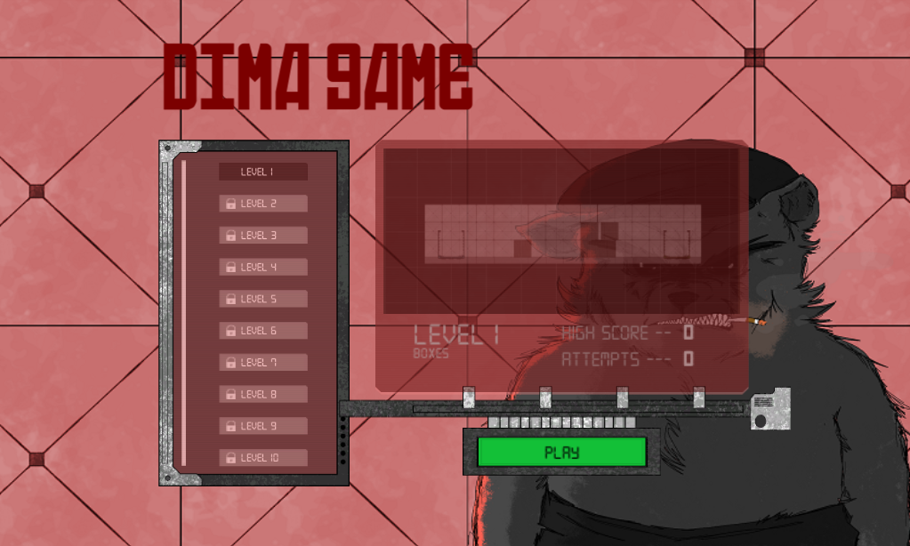
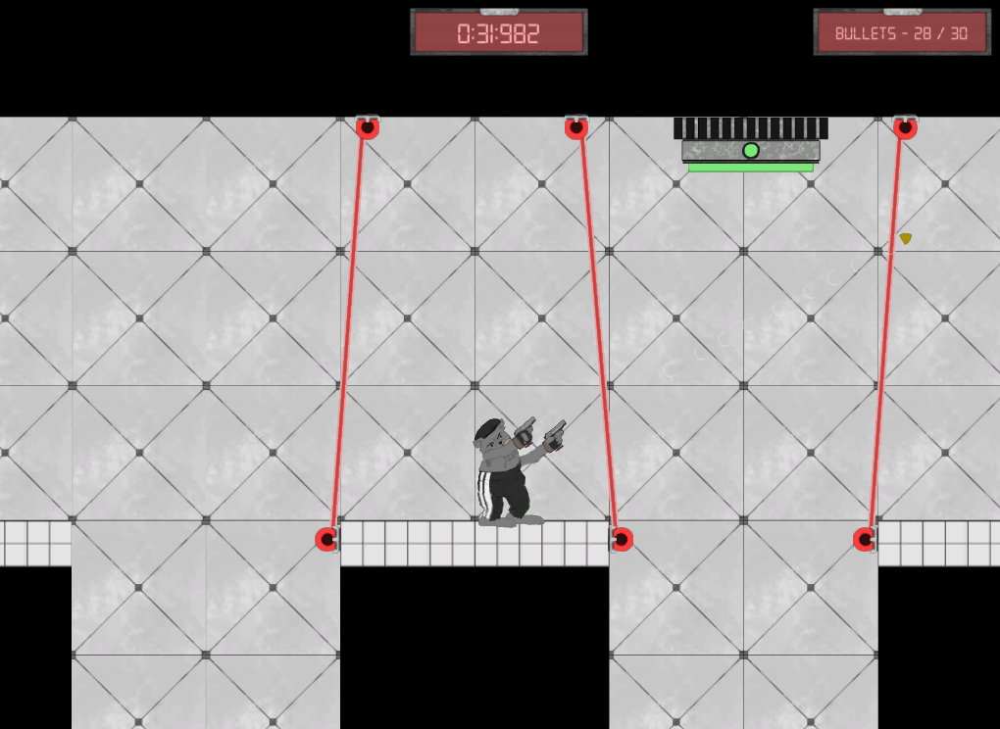

# Dima Game
## Kesän 2020 Unity peliprojekti

Tässä on kesällä 2020 tekemäni Unity peliprojekti, jonka tein osana projektiopintoja Kaakkois-Suomen Ammattikorkeakoulussa. Projektiin osallistui itseni lisäksi kaksi muuta luokkatoveria. Omalla vastuulla oli pelin grafiikkojen, koodin, animaatioiden ja kenttien luonti, sekä ääniefektien löytäminen. Projektin toinen jäsen Tero Lamminpää oli myös avustamassa pelin koodin luomisessa. Projektin kolmas jäsen Santeri Hartikainen taas loi pelissä käytettävän musiikin.

 Peli on 24 tason mittainen 2D tasohyppely/puzzle peli. Pelissä pelataan Dima-nimisellä karvaisella eläimellä, jolla on hallussaan 2 makarov pistoolia. Kentät sisältävät monenlaisia vaaroja, kuten sudenrautoja, miinoja, laasereita ja tykkitorneja, sekä myös painikkeita, joita aktivoimalla voidaan kentissä avata ovia ja reittejä maalia kohti.

 Tämä kansio sisältää valmiiksi käännetyn pelin.

 

  

*Pelin kenttävalikko*

  

*Esimerkkikuva pelin kolmannesta kentästä*

---  

Projektin github repoa pääset katsomaan <a href="https://github.com/VpSassi/Dima_game">täältä</a>

Työssä käytetyt äänet on ladattu <a href="https://freesound.org/">freesound.org</a> -sivulta
