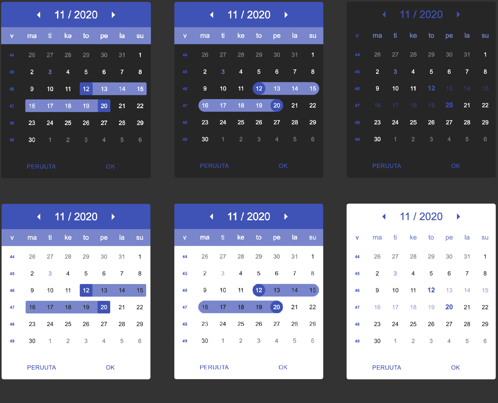
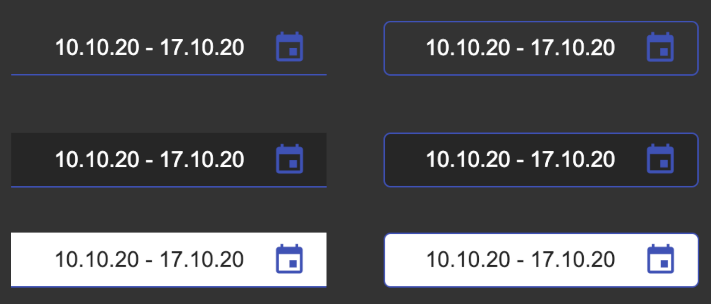

# Komponenttikehitys Framerin ja Storybookin avulla
## Opinnäytetyö

Tässä on Kaakkois-Suomen Ammattikorkeakoulussa syyslukukaudella 2020 tekemäni opinnäytetyö, jonka aiheena oli komponenttisuunnittelu <a href="https://www.framer.com/"> Framerin</a> ja <a href="https://storybook.js.org/"> Storybookin</a> avulla. Työn alussa kerrotaan ensiksi työssä käytettävistä työkaluista ja tekniikoista, joista siirrytään siinä demottavan komponentin luontiprosessiin. Työn aikana seurataan demottavan kalenterikomponentin suunnittelu- ja luontiprosessi ja todetaan lopussa käytettyjen tekniikoiden toimivuus. Työn lopputuloksena saatiin aikaiseksi toimiva kalenterikomponentti ja toimeksiantajayritykselle <a href="https://www.mindhive.fi/">Mindhive Oy</a>:lle todiste konseptista käyttää valittuja työkaluja ja tekniikoita tulevissa asiakasprojekteissa.

   
  
  

*Esimerkki kalenterikomponentin eri kustomointivaihtoehdoista*  

  

*Esimerkki kalenterikomponentin laukaisevista syöttökentistä*

 

**Opinnäytetyö on saatavana myös theseuksessa, alla olevan linkin kautta**

http://www.urn.fi/URN:NBN:fi:amk-2020120225680